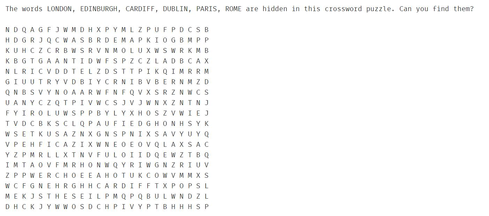
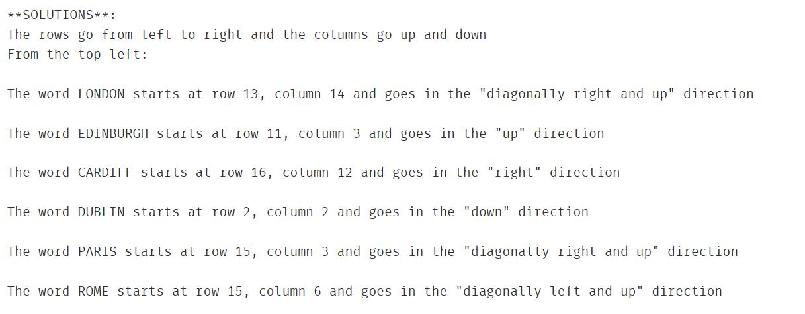
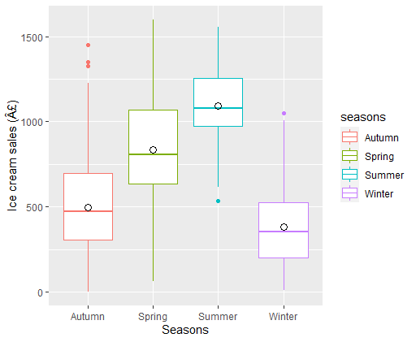
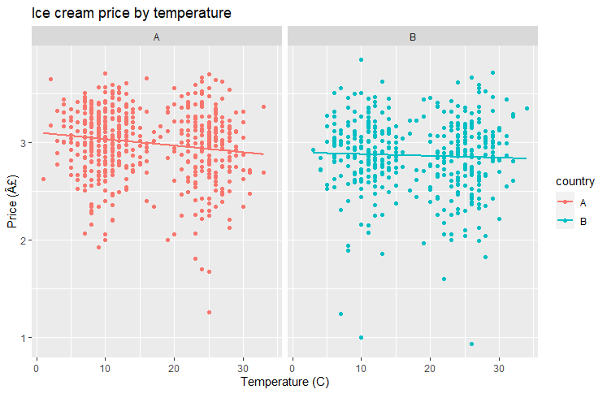
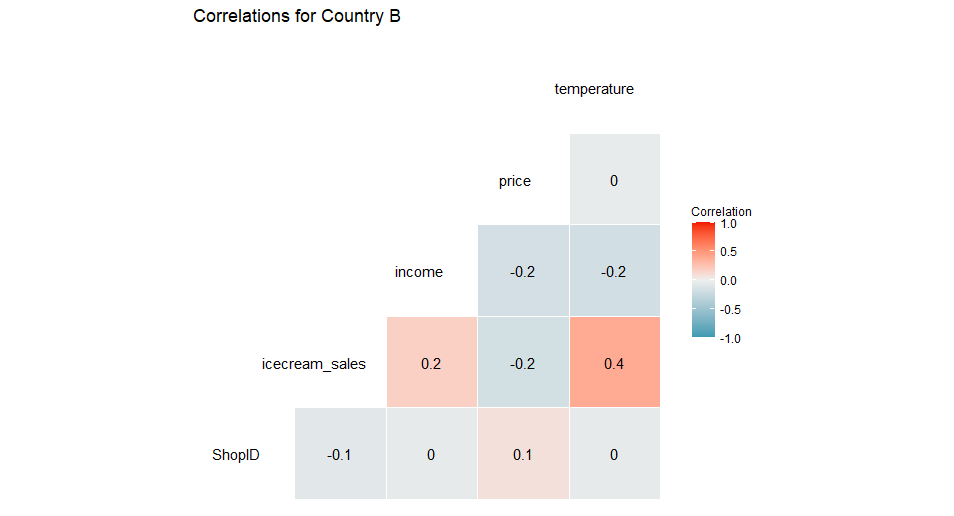

## A collection of my work as an MSc Data Science for Business student

# [Project 1: A Python Wordsearch Generator and Solver](https://github.com/chris-rainford/Wordsearch-Generator-and-Solver/blob/main/Wordsearch%20generator%20and%20solver%20(1).ipynb) 
* Created a wordsearch generator, allowing users to enter a selection of words which will be included in a generator wordsearch
* Additionally, a solver is included which provides the starting grid reference and direction of each word in the puzzle
 
 

# [Project 2: A Consultancy-style task using Python packages to access JSON and CSV files](https://github.com/chris-rainford/Consultancy-Style-Python-Project/blob/main/A%20Consultancy%20style%20task%20using%20JSON%20and%20CSV%20files.ipynb) 
* Reading JSON file contents into string arrays, list of rows, dictionary objects
* Working with keys in dictionary structures 
* Includes a function which takes a Username and returns the relevant full dictionary for that user
* Includes a function which takes a product ID and returns the full dictionary for the associated product 
* Reading CSV files into data frames and working with data fields

# [Project 3: Statistical Analysis in R for an Ice Cream Company](https://github.com/chris-rainford/Statistical-Analysis-for-an-Ice-Cream-Company/blob/main/Exploratory%20Data%20Analysis%2C%20Hypothesis%20Testing%2C%20Modelling%20and%20Prediction%20in%20R.R) 
* Exploratory Data Analysis
* Hypothesis Testing
* Modelling (mulitple linear regression)
* Predictions

 
